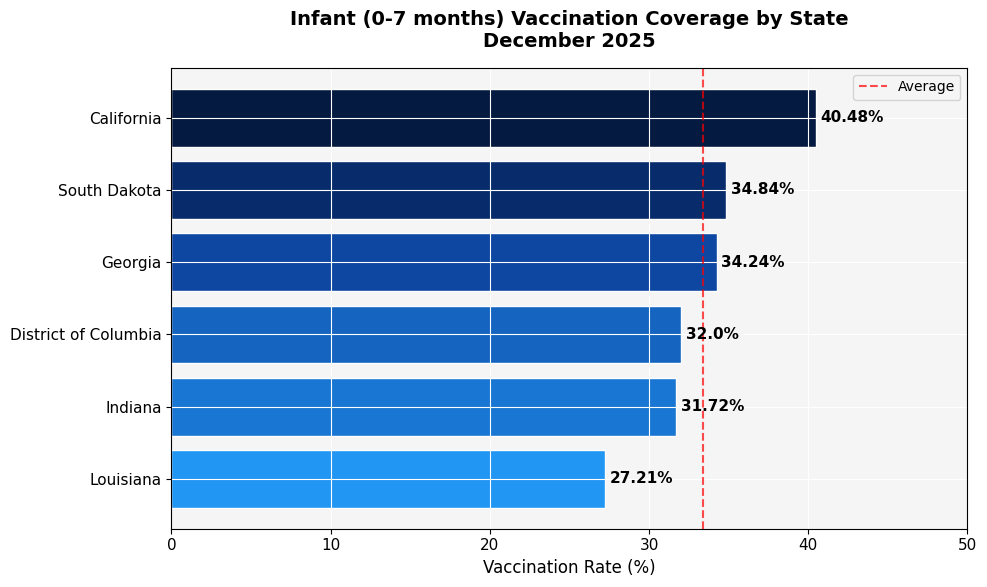
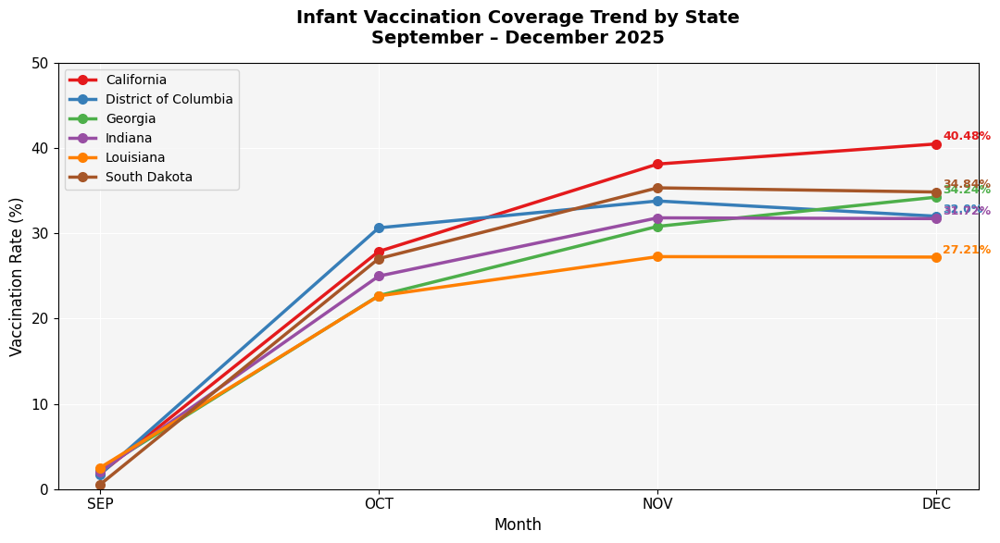
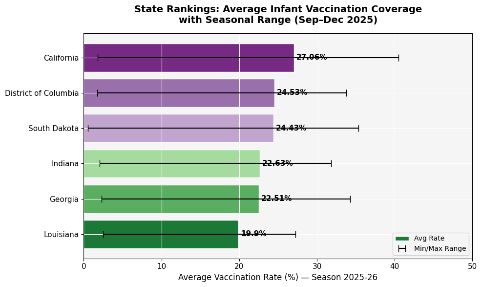

# 🏥 CDC Infant Vaccination Coverage ETL Pipeline


## 📌 Overview
An end-to-end ETL pipeline analyzing CDC infant vaccination coverage data 
across U.S. states using **Databricks**, **PySpark**, and **Delta Lake**. 
Implements the **Medallion Architecture** (Bronze → Silver → Gold) to 
progressively clean, transform, and aggregate raw public health data into 
actionable insights.

Built as part of a data engineering portfolio demonstrating real-world 
pipeline design aligned with Databricks best practices.

---

## 🏗️ Architecture
```
CDC Source Data (CSV)
        │
        ▼
┌─────────────────┐
│  🥉 BRONZE      │  Raw ingestion, zero transformations
│  252 rows       │  Preserved exactly as received
│  Delta Table    │
└────────┬────────┘
         │
         ▼
┌─────────────────┐
│  🥈 SILVER      │  Cleaned & transformed
│  24 rows        │  Nulls handled, types cast,
│  Delta Table    │  columns standardized
└────────┬────────┘
         │
         ▼
┌─────────────────┐
│  🥇 GOLD        │  Business-level aggregations
│  Insights       │  Ready for visualization
│  Delta Table    │  and reporting
└────────┬────────┘
         │
         ▼
  📊 Visualizations
  (Matplotlib charts)
```

---

## 🛠️ Tech Stack

| Tool | Purpose |
|------|---------|
| Databricks Community Edition | Cloud compute & notebook environment |
| PySpark | Distributed data processing |
| Delta Lake | ACID-compliant table storage |
| Python (Pandas, Matplotlib) | Data analysis & visualization |
| SQL (Spark SQL) | Table querying & aggregation |
| Unity Catalog | File & volume management |

---

## 📊 Key Insights

### 1. Vaccination Coverage by State (December 2025)

- **California** leads with **40.48%** coverage — highest among reporting states
- **Louisiana** trails at **27.21%** — notably below the 33% average
- Only **3 of 6 states** exceeded the average coverage rate

### 2. Monthly Trend Analysis (Sep–Dec 2025)

- All states show a **dramatic surge from SEP → OCT** as flu season begins
- Coverage growth **plateaus in NOV → DEC** suggesting early adopter saturation
- **California** shows the steepest and most sustained growth trajectory
- **South Dakota** punches above its weight relative to population size

### 3. State Rankings with Seasonal Range

- **California** has the widest seasonal range (1.78% → 40.48%)
  indicating strong program ramp-up
- **Louisiana** consistently underperforms across all metrics
- Rankings shift notably between monthly snapshots vs. seasonal averages

---

## 🗂️ Dataset

| Detail | Value |
|--------|-------|
| Source | CDC National Immunization Survey |
| URL | https://data.cdc.gov |
| File | Monthly Cumulative Coverage by States |
| Season | 2025-26 |
| Age Group | 0-7 months (infant) |
| States Reporting | CA, DC, GA, IN, LA, SD |
| Raw Records | 252 |
| Valid Records | 24 |

---

## 📁 Project Structure
```
cdc-vaccine-etl-pipeline/
│
├── notebooks/
│   └── cdc_vaccine_pipeline.ipynb    # Main Databricks notebook
│
├── charts/
│   ├── chart1_vaccination_by_state.png
│   ├── chart2_monthly_trend.png
│   └── chart3_state_rankings.png
│
├── data/
│   └── Monthly_Cumulative_Coverage_States.csv
│
└── README.md
```

---

## ⚙️ How to Run

1. **Clone this repo**
```bash
git clone https://github.com/yourusername/cdc-vaccine-etl-pipeline.git
```

2. **Upload to Databricks**
   - Import `notebooks/cdc_vaccine_pipeline.ipynb` into Databricks
   - Upload CSV to a Unity Catalog Volume

3. **Run notebook top to bottom**
   - Bronze → Silver → Gold layers execute sequentially
   - Charts render inline and save to working directory

4. **Requirements**
   - Databricks Community Edition (free)
   - Python 3.10+
   - matplotlib==3.7.1

---

## 🔍 Data Quality Notes

> ⚠️ **228 of 252 raw records** contained "Not Submitted" values in the  
> Numerator field with null Estimates — indicating states that did not  
> report data for that period. These were flagged and excluded in the  
> Silver layer while being fully preserved in Bronze per Medallion  
> Architecture best practices.

---

## 👤 Author

**Fahim Akbar**  
M.S. Data Analytics | Databricks Certification (In Progress)  
[LinkedIn](your-linkedin-url) | [GitHub](your-github-url)

---

## 🔮 Future Enhancements

- [ ] Expand to all 50 states when data becomes available
- [ ] Add Databricks Workflows for automated weekly pipeline runs
- [ ] Build interactive Streamlit dashboard from Gold layer
- [ ] Add demographic breakdown beyond 0-7 month age group
- [ ] Compare 2024-25 vs 2025-26 season over season trends
